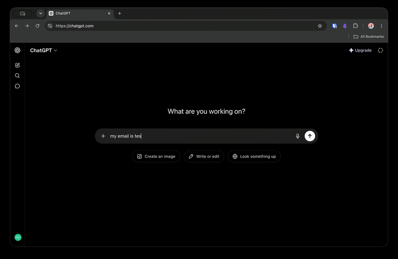

# Taglio ✂️

> Cuts PII out of your prompts before they reach the LLM.

**🔒 Zero data collection · Zero network calls · Zero special permissions · Zero runtime dependencies**

Browser extension (Chrome MV3) that detects sensitive data in your ChatGPT prompts locally and blocks or sanitizes before send. No proxies. No servers. Nothing leaves your device — [verify it yourself in 2 minutes](#privacy--taglio-collects-nothing).



## Phase 0 — what works right now

- **Real-time detection** as you type: email, IBAN, Codice Fiscale, Italian mobile numbers, credit cards (Luhn-validated)
- **Inline underlines** on matched PII via CSS Custom Highlight API — no DOM modification
- **Submit gate**: intercepts Enter / click and shows a banner with detected items
- **Sanitize and send**: replaces PII with `[EMAIL]`, `[IBAN]`, `[CF]`, etc., then submits
- **Send anyway**: lets you override with one click
- Active on `chatgpt.com` and `chat.openai.com`

## Privacy — Taglio collects nothing

Taglio is built so it *can't* leak your data, not just promised not to:

- **No data collection.** Zero. No prompts, no detected PII, no usage stats.
- **No network requests.** The extension makes no calls to any server — there is no backend, no API, no telemetry endpoint. Detection is pure regex running in your browser.
- **No analytics.** No tracking pixels, no error reporting services, nothing phones home.
- **Nothing stored.** Phase 0 keeps no history. Detected matches live in memory only and vanish when you close the tab.
- **Open source.** Every line is in this repo — [`lib/engine.ts`](lib/engine.ts) is the entire detection logic. Audit it yourself.

The whole point of Taglio is keeping your PII *out* of third-party hands. Sending it to ours would defeat the purpose.

### Verify it yourself

Don't take our word for it — every claim above is checkable against the source in under 2 minutes:

| Claim | How to verify |
|---|---|
| No network calls | `grep -rE "fetch\(\|XMLHttpRequest\|sendBeacon\|WebSocket" entrypoints lib` → no matches (the only URL in the codebase is the GitHub link in the popup) |
| No storage | `grep -rE "localStorage\|chrome\.storage\|indexedDB" entrypoints lib` → no matches |
| No special permissions | Build and inspect `.output/chrome-mv3/manifest.json` → no `permissions` key at all, only `content_scripts` scoped to `chatgpt.com` / `chat.openai.com` |
| No third-party code at runtime | `package.json` → `dependencies` is empty. TypeScript, Vitest and WXT are dev-only |
| Background does nothing | [`entrypoints/background.ts`](entrypoints/background.ts) is a 3-line placeholder |

If a future version ever needs a permission or a network call (e.g. downloading the NER model in Phase 1), it will be documented here first, with the reason.

## Install (dev)

```bash
git clone https://github.com/adrianofontanari/taglio
cd taglio
npm install
npm run dev       # opens Chrome with extension loaded via hot-reload
```

Or build once:

```bash
npm run build
# Load .output/chrome-mv3 as unpacked extension in chrome://extensions
```

## Architecture

```
Detection Engine (TypeScript, no DOM)
├── Tier 0: Regex   ← Phase 0, this release
├── Tier 1: NER     ← Phase 1, transformers.js
└── Tier 2: LLM     ← Phase 2, web-llm sanitization
```

The engine is pure TypeScript with zero DOM dependencies (`lib/engine.ts`). The content script is the only surface — same engine will power a desktop app and SDK in later phases.

## Roadmap

| Phase | Status | Output |
|---|---|---|
| **0 — Spike** | ✅ Done | Regex detection on ChatGPT, submit gate, inline highlights |
| **1 — MVP** | Planned | NER via transformers.js, adapter for Claude + Gemini, Chrome Web Store |
| **2 — Production** | Planned | Constrained-decoding sanitization, policy JSON, Firefox |
| **3 — Desktop** | Optional | Tauri clipboard guard, Python SDK |

## License

MIT — see [LICENSE](LICENSE).
